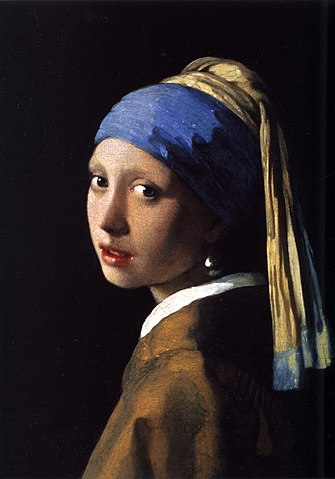

# Palette

<div style="display:flex;align-items:center;align-content:center;flex-direction:column;gap:10px;"></div>

## Overview

Palette is a Python package for extracting colors from images and displaying the results as palettes and in text form of color percentages, RGB, HEX values and names.

A merge function is used to reduce the amount of colors listed in the output by calculating the distance (difference) between two RGB values and comparing it to the provided sensitivity / tolerance value. The names of the colors are being fetched by the [Color Names API](https://github.com/meodai/color-names).

## Installation

This package requires you to have Python version >= 3.6 installed. Either use your OS's package manager or follow the instructions [here](https://www.python.org/downloads/). Then, clone or download this repository, change into the folder and execute the command below.

```
$ pip install .
```

## Usage

### Basic

A list of `Color` objects sorted by their percentages can be created by calling the `extract_colors_from_path` function and passing an image file path or calling the `extract_colors_from_image` and passing an already loaded image.

```python
>>> from palette import extract_colors_from_path

>>> colors = extract_colors_from_path(my_image_path, my_limit, my_sensitivity)["colors"]
>>> print(colors)

[(rgb: (19, 14, 20), hex: #130e14, percentage: 71.70, name: Back In Black), (rgb: (42, 32, 30), hex: #2a201e, percentage: 11.40, name: Dark Orchestra), (rgb: (68, 50, 38), hex: #443226, percentage: 6.37, name: Woodburn)]
```

```python
>>> from palette import extract_colors_from_image

>>> colors = extract_colors_from_image(my_image, my_limit, my_sensitivity)["colors"]
>>> print(colors)

[(rgb: (19, 14, 20), hex: #130e14, percentage: 71.70, name: Back In Black), (rgb: (42, 32, 30), hex: #2a201e, percentage: 11.40, name: Dark Orchestra), (rgb: (68, 50, 38), hex: #443226, percentage: 6.37, name: Woodburn)]
```

### Command-Line

Extracted colors can also be listed using the command-line.

```
usage: palette [-h] [-l L] [-s S] [-p P] path

palette is a tool for extracting colors from an image

positional arguments:
  path        path to image file

optional arguments:
  -h, --help  show this help message and exit
  -l L        maximum number of colors to extract (default: 10)
  -s S        color merging sensitivity on a scale of 0 to 100 for clearer results (default: 30)
  -p P        create a color palette (default: True)
```

#### Example

```
$ palette example.jpg -l 10 -s 60
Image: example.jpg
Maximum number of colors: 10
Color sensitivity: 60
Create palette: True

Extracting...

Color extraction completed at: 05:58 PM, 10/29/2022
Palette created as example-palette.png
  1.  75.94% : RGB (19, 14, 20)   , HEX #130e14, Name Back In Black
  2.  15.48% : RGB (68, 50, 38)   , HEX #443226, Name Woodburn
  3.   8.53% : RGB (150, 102, 54) , HEX #966636, Name Woodgrain
  4.   4.85% : RGB (186, 137, 97) , HEX #ba8961, Name Tatami Tan
  5.   4.52% : RGB (60, 76, 101)  , HEX #3c4c65, Name Silent Sea
  6.   3.80% : RGB (112, 125, 116), HEX #707d74, Name Boreal
  7.   3.54% : RGB (211, 172, 141), HEX #d3ac8d, Name Cliff Brown
  8.   2.66% : RGB (70, 90, 161)  , HEX #465aa1, Name Nuthatch Back
  9.   2.22% : RGB (129, 35, 27)  , HEX #81231b, Name Falu Red
 10.   2.02% : RGB (239, 212, 193), HEX #efd4c1, Name Cream of Mushroom
```
